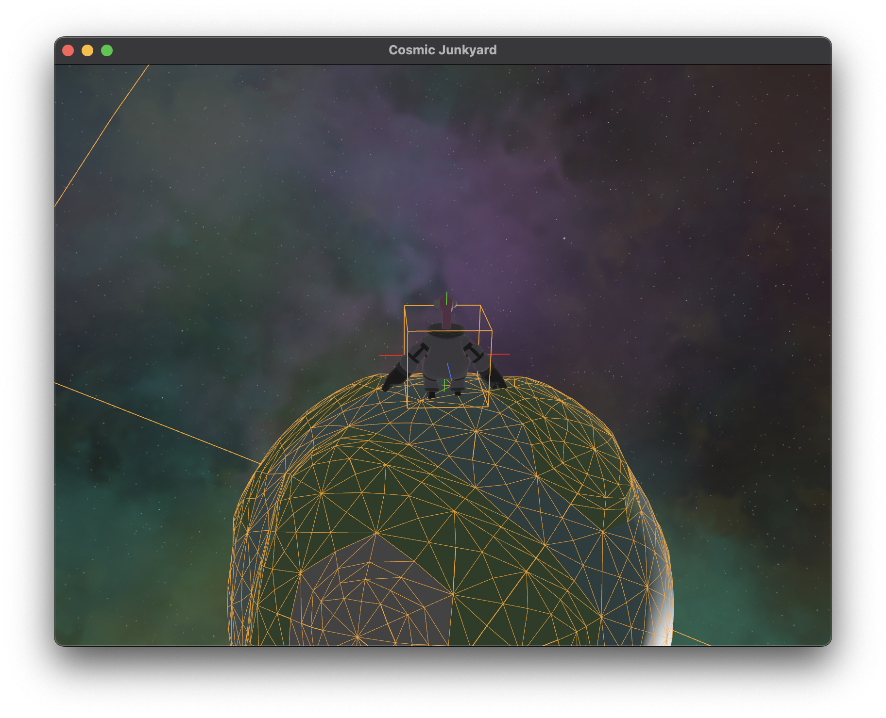

# Cosmic Junkyard - Working Title

## Description



There is no real game idea other than I was interested in [this video](https://www.youtube.com/watch?v=QLH_0T_xv3I&t=2s).

TODO:

## Setup

**Step 1:** Install Git LFS.

I use Git LFS to store the large project files such as the models, sound effects, etc. You can download it from the [Git LFS website](https://git-lfs.github.com/) or if you are on macOS and use Homebrew, you can install it via the terminal with:

```bash
brew install git-lfs
```

For Linux, you can use:

```bash
sudo apt-get install git-lfs
```

**Step 2:** Clone the repository

```bash
git clone https://github.com/stargazing-dino/cosmic-junkyard.git

cd cosmic-junkyard
```

**Step 3:** Initialize Git LFS

Once you have Git LFS installed, you need to set it up for use with our Git repository.

```bash
git lfs install
```

**Step 4:** Run the game

```bash

cargo run
```

## Credits

Models
https://quaternius.com/packs/ultimatespacekit.html

Space backgrounds
https://screamingbrainstudios.itch.io/seamless-space-backgrounds

Interface bleeps
https://bleeoop.itch.io/interface-bleeps

Music
https://lowenergygirl.itch.io/space-journey

Space sound effects
https://gamesupply.itch.io/200-space-sound-effects
